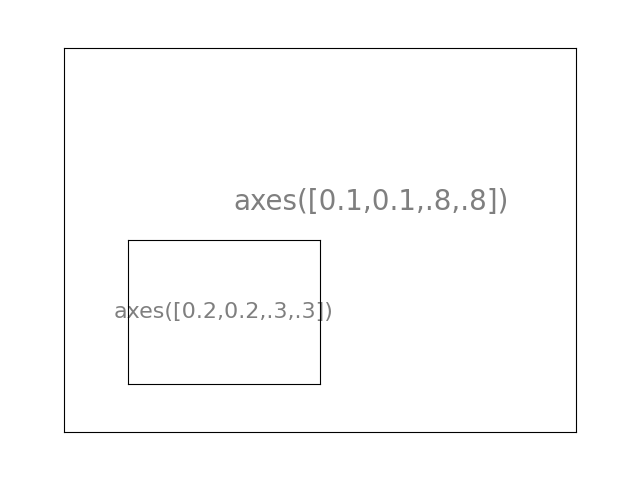
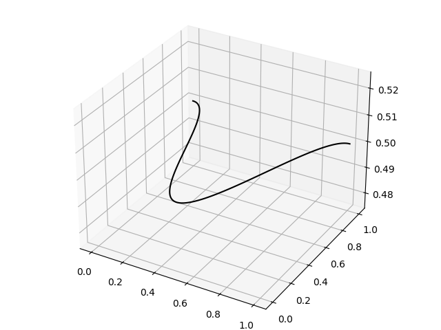

# D19: Charting by Matplotlib

*	Subplots: subplots separate each other. arguments to subplot are row, column, order. Ex: `plt.subplot(2,1,1)` means two rows one column and the first subplot.

*	Axes: subplots in a figure. Ex:
```
#import matplotlib.pyplot as plt

#決定最外框
plt.axes([0.1,0.1,.8,.8])
plt.xticks([]), plt.yticks([])
plt.text(0.6,0.6, 'axes([0.1,0.1,.8,.8])',ha='center',va='center',size=20,alpha=.5)

#決定內框
plt.axes([0.2,0.2,.3,.3])
plt.xticks([]), plt.yticks([])
plt.text(0.5,0.5, 'axes([0.2,0.2,.3,.3])',ha='center',va='center',size=16,alpha=.5)

plt.show()
```


*	3D plot: 
```
#導入必要的模組
import numpy as np
import matplotlib.pyplot as plt
from mpl_toolkits.mplot3d import Axes3D

# 創建一個3d坐標系
fig = plt.figure()
ax = Axes3D(fig)
#直接查詢參數與設定
#help(plt.plot)
#help(np.random.sample)

# 利用x軸和y軸繪製sin曲線
x = np.linspace(0, 1, 100) # linspace創建等差陣列
y = np.cos(x * 2 * np.pi) / 2 + 0.5
# 通過zdir = 'z' 將資料繪製在z軸，zs = 0.5 則是將資料繪製在z = 0.5的地方
ax.plot(x, y, zs = 0.5, zdir = 'z', color = 'black', label = 'curve in (x, y)')
```


