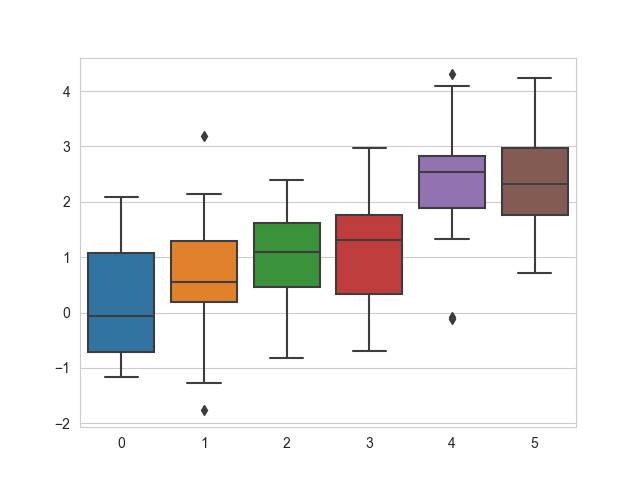

# D20: Data Visualization by Seaborn

*	seaborn can plot many visualized statistic plots and grid plot. There are five seaborn themes: darkgrid, whitegrid, dark, white, and ticks; the default is darkgrid. `seaborn.set_style('whitegrid')` or others.<br>
Simple example for seaborn:<br>
```
import numpy as np
import matplotlib.pyplot as plt
import seaborn as sns

data = np.random.normal(20, 6) + np.arange(6) / 2
sns.set_style('whitegrid')
sns.boxplot(data=data)
plt.show()
```



*	seaborn can also contain the confidence interval, so called CI, when plotting line chart. The default is True, or set off CI by `ci=None`. the option also have sd, means standard deviation. With a simple scatter plot, just use `seaborn.relplot(x='xtitle', y='ytitle', hue='legend_name', kind='scatter', data=)`

*	regplot & lmplot: [see here](https://seaborn.pydata.org/generated/seaborn.regplot.html)

