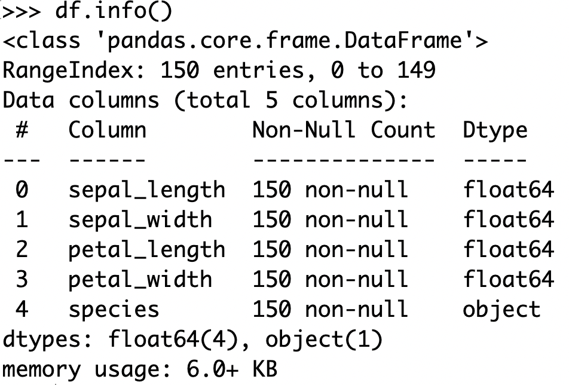
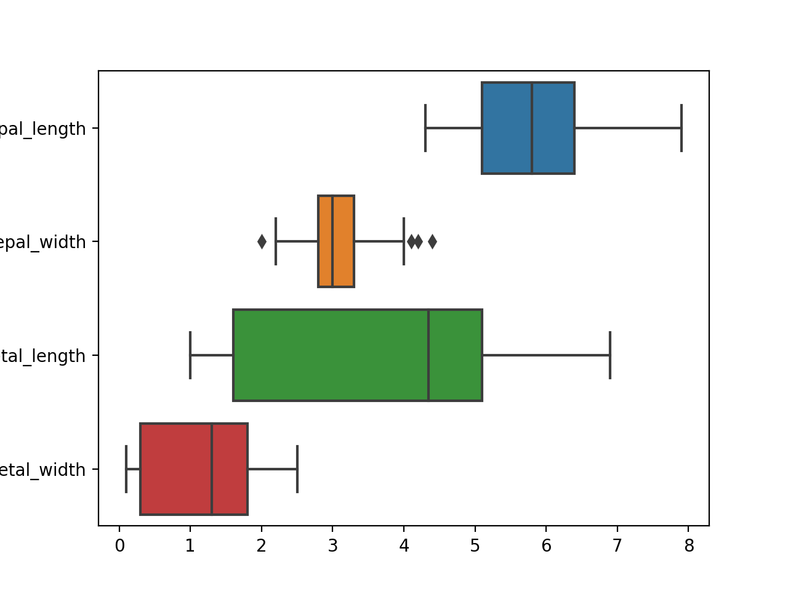
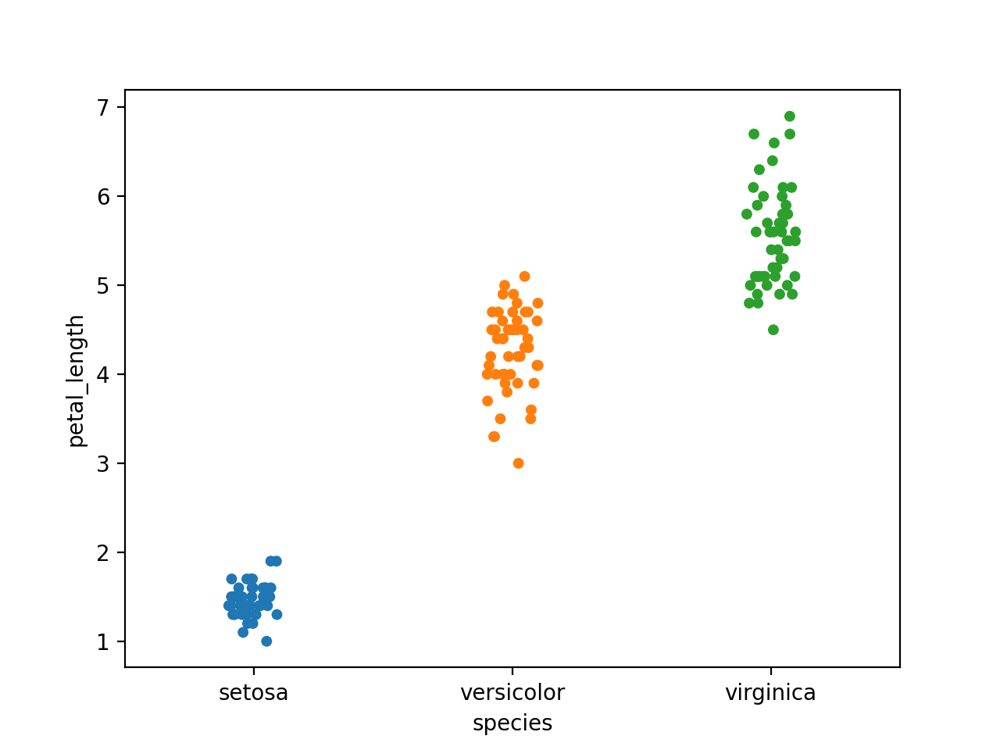
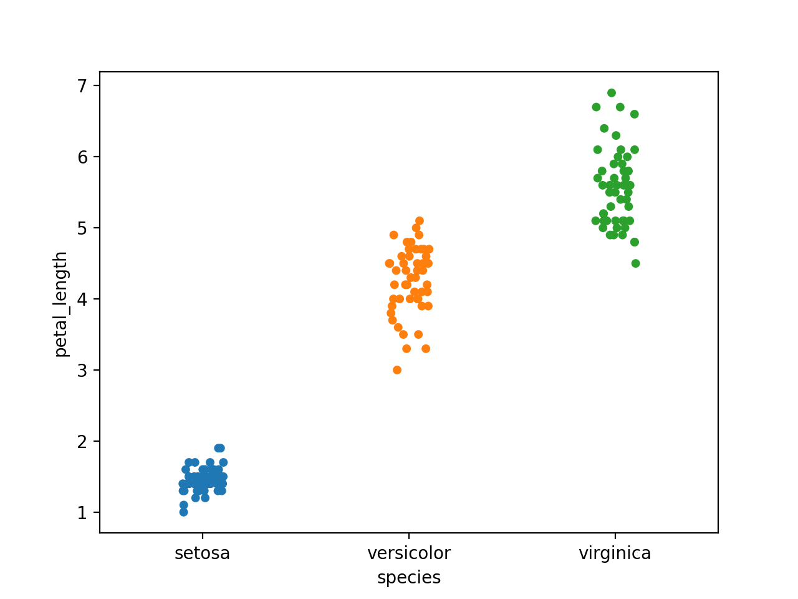
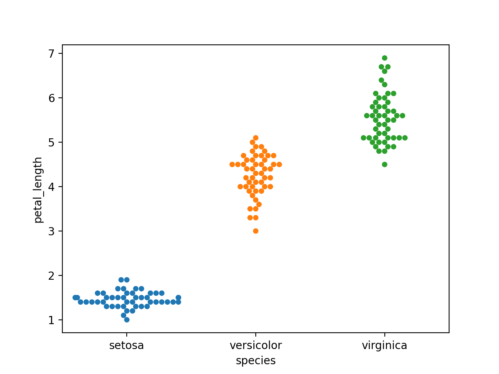
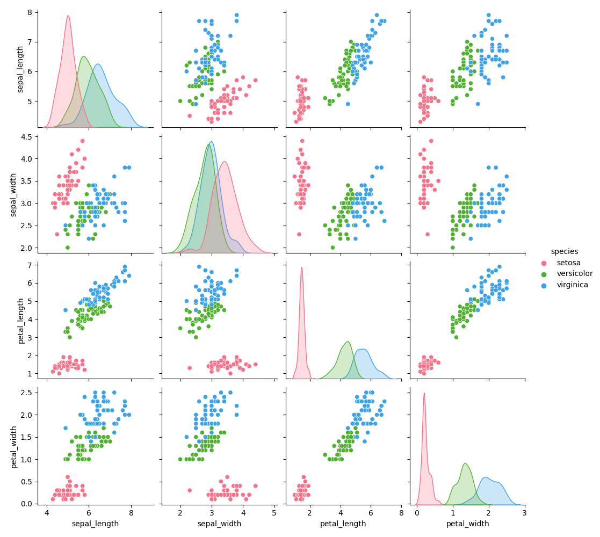

# D21: Data Visualization with real-world data

*	after install seaborn package, it contains some useful testing dataset, we can load them by `seaborn.load_dataset({name}.csv or dataset on [https://github.com/mwaskom/seaborn-data](https://github.com/mwaskom/seaborn-data))`. It returns pandas DataFrame.
*	for exercise, we can include 'iris' example dataset in seaborn package.
```
df = sns.load_dataset('iris')
df.info()
```



```
sns.boxplot(data=df, orient='h')
```



scatter plot
```
sns.stripplot(x = "species", y = "petal_length", data = df)
```



to avoid the overlap point, we add jiter option:<br>

```
sns.stripplot(x = "species", y = "petal_length", data = df, jitter=True)
```



here is another way to avoid the overlap point:<br>
```
sns.swarmplot(x = "species", y = "petal_length", data = df)
```



* * *

*	Kernel Desity Estimate (KDE): use to plot the density of dataset, there is an example for KDE:<br>

```
sns.pairplot(df,hue = 'species',diag_kind = "kde",kind = "scatter",palette = "husl")
```




