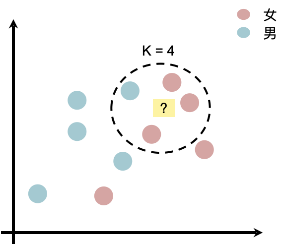

# D37: EDA missing value and abnormal value advanced repair strategy
Here we have a data with sex, age, height, and weight. If there are some missing value, we need to repair them with some strategies, like mean value repairing. 
But sometimes the result is not agreed with some truth, for example someone is 176 cm tall, but the repair weight is 47kg by mean value. It's weird, right? Is there a better strategy? 
* * *
# K-Nearest Neighbor (KNN)
It's a non-probability distribution algorithm, estimate the missing value with the nearest k values. 

because KNN is using majority decision, so it's better to choose odd "k". 
* * *
# KNN three steps
1. calculate the distance 
	there are two definitions of distance: 
		with two point  and  
		- Euclidean distance: 
			 
		- Manhattan distance: 
			 
	we use Euclidean distance in this lecture. 
2. find the nearest k values 
3. majority decision with those data 

