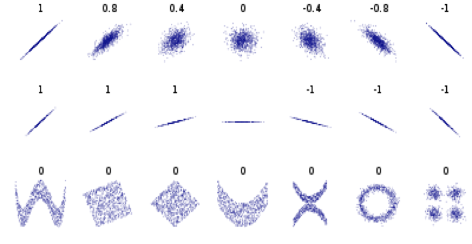

# D38: Relation Between Variables
Between different variables, there are some relationship: 
*	continuous v.s. continuous<br>
	Pearson correlation<br>
*	discrete v.s. discrete<br>
	Cramer's V parameter<br>
*	continuous v.s. discrete<br>
	*	Point biserial's correlation
	*	Cohen's ds
	*	eta-squared

* * *

# continuous v.s. continuous: Pearson correlation
<br>

pearson correlation is between -1 and 1.<br>
<br>
if not linear correlation, pearson value is about 0, or less than 0.1 (row 3).<br>
we can use `stats.pearson` to calculate pearson r.<br>
```
corr, _ = stats.pearson(data['hegiht'], data['weight'])
print(corr)
```

* * *

# discrete v.s. discrete: Cramer's V parameter
<br>
, where r is rows of contingency table, c is columns of contingency table, n is total number of data, chi-square is derived from Pearson's chi-squared test.<br>
# Use researchpy.crosstab to Calculate Correlation
step 1: we need to first create the cross table(contingency table).<br>
```
contTable = pd.crosstab(data['sex'], data['insomnia'])
```

step 2: calculate degree of freedom: df = min(r, c) - 1<br>
```
df = min(contTable.shape[0], contTable.shape[1]) - 1
```

step 3: use reaserchpy to calculate the result.<br>
```
crosstab, res = reaserchpy.crosstab(data['sex'], data['insomnia'], test='chi-square')
print('Cramer's V is: res.loc[2, 'results'])
```

* * *


